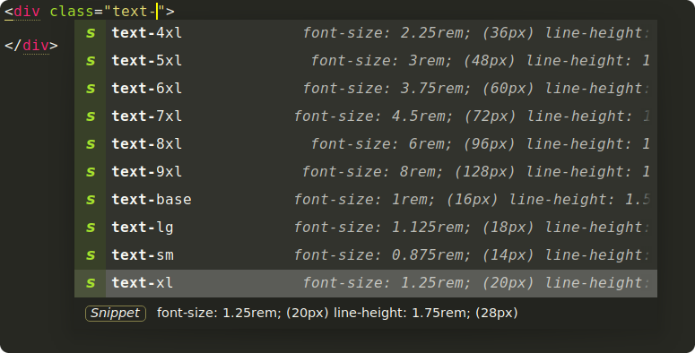

# Tailwind CSS Completions

Provides [Tailwind CSS](https://tailwindcss.com) completions for Sublime Text.



## Installation

### Package Control installation

*Pending addition to package control channel*

The preferred method of installation is [Package Control](https://packagecontrol.io/browse/authors/gerardroche).

### Manual installation

Close Sublime Text, then download or clone this repository to a directory named `Tailwind CSS Completions` in the Sublime Text Packages directory for your platform:

* Linux: `git clone https://github.com/gerardroche/sublime-tailwind-css-completions.git ~/.config/sublime-text-3/Packages/Tailwind CSS Completions`
* OSX: `git clone https://github.com/gerardroche/sublime-tailwind-css-completions.git ~/Library/Application\ Support/Sublime\ Text\ 3/Packages/Tailwind CSS Completions`
* Windows: `git clone https://github.com/gerardroche/sublime-tailwind-css-completions.git %APPDATA%\Sublime/ Text/ 3/Packages/Tailwind CSS Completions`

## Usage

By default, completions are triggered automatically when typing. If the setting `auto_complete` is set to false then completions must be manually triggered.

OS X | Windows | Linux | Description
-----|---------|-------|------------
<kbd>Ctrl</kbd>+<kbd>Space</kbd> | <kbd>Ctrl</kbd>+<kbd>Space</kbd> | <kbd>Alt</kbd>+<kbd>/</kbd> | Activate completions


Sublime Text has many interesting settings for configuring auto complete.

**Menu > Preferences > Settings**

```text
{
    // By default, auto complete will commit the current completion on enter.
    // This setting can be used to make it complete on tab instead.
    // Completing on tab is generally a superior option, as it removes
    // ambiguity between committing the completion and inserting a newline.
    "auto_complete_commit_on_tab": false,

    // Controls if auto complete is shown when snippet fields are active.
    // Only relevant if auto_complete_commit_on_tab is true.
    "auto_complete_with_fields": false,

    // ...
}
```

## License

Released under the [BSD 3-Clause License](LICENSE).
